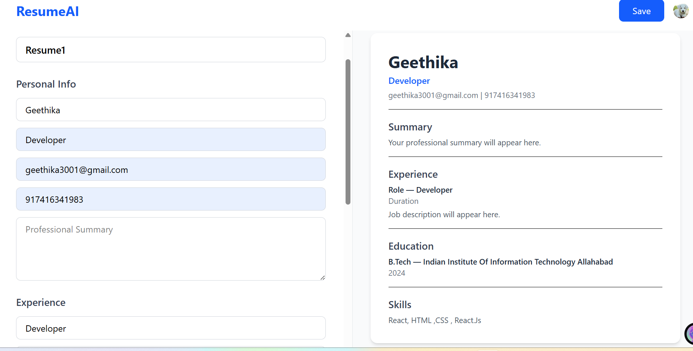
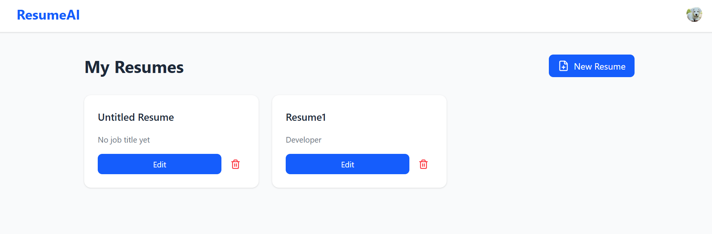

# AI Resume Builder 🚀

A smart resume builder powered by the MERN stack with real-time editing and live preview.

## 🔗 Live Demo
[https://airesbuilder.vercel.app](https://airesbuilder.vercel.app)
## 📸 Screenshots

### Home Page


### Dashboard


### Edit Resume

## 🛠️ Tech Stack
- **Frontend:** React, Vite, Tailwind CSS
- **Backend:** Node.js, Express
- **Database:** MongoDB, Mongoose
- **Authentication:** Clerk
- **Deployment:** Vercel

## ✨ Features
- Google authentication via Clerk
- Create, edit and delete resumes
- Real-time live preview while editing
- Responsive and minimal UI
- REST API backend

## 🚀 Getting Started

### Frontend
```bash
npm install
npm run dev
```

### Backend
```bash
cd server
npm install
node index.js
```

### Environment Variables

**Root `.env`:**
```
VITE_CLERK_PUBLISHABLE_KEY=your_clerk_key
```

**`server/.env`:**
```
PORT=5000
MONGO_URI=your_mongodb_uri
```